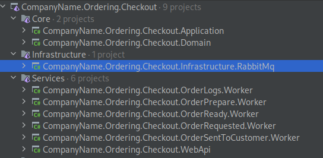
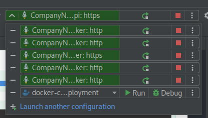
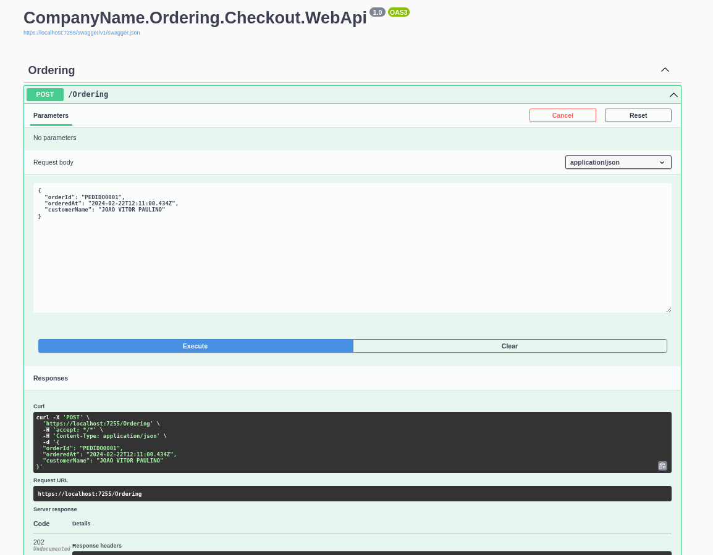
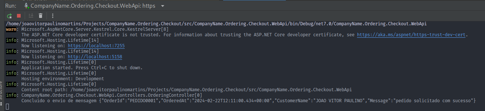
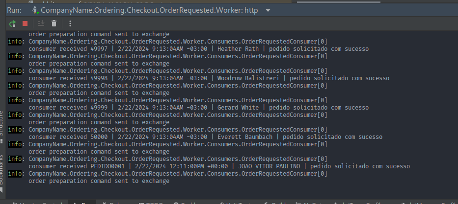
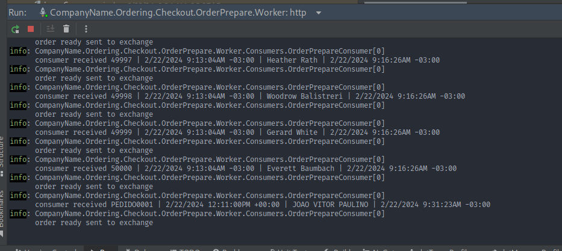
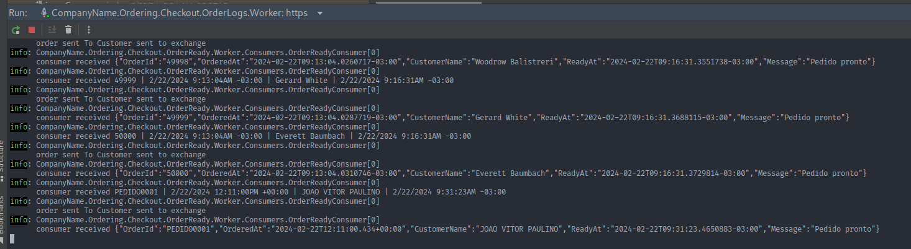
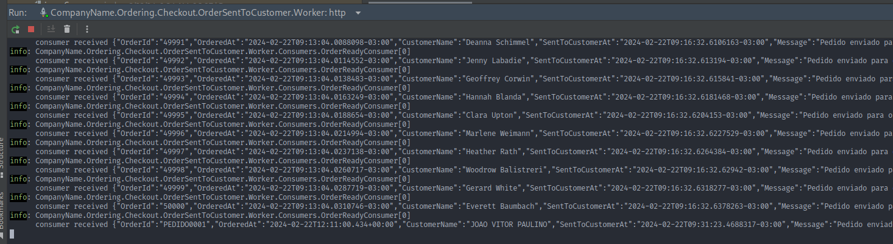
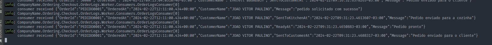

# Conceitos do RabbitMQ

## Exchange:
- No RabbitMQ, as mensagens são publicadas em trocas (exchanges). Uma troca é responsável por receber mensagens dos produtores e roteá-las para filas.
- Existem vários tipos de trocas, cada uma roteia as mensagens de maneira diferente:
    - *Direct Exchange*: Roteia mensagens com base em uma chave de roteamento exata.
    - *Fanout Exchange*: Roteia mensagens para todas as filas vinculadas a ela.
    - *Topic Exchange*: Roteia mensagens com base em padrões de roteamento que usam curingas (*).
    - *Headers Exchange*: Roteia mensagens com base em cabeçalhos de mensagem em vez de rotear com base na rota.

## Queue (Fila):
- Uma fila é onde as mensagens são armazenadas até que sejam consumidas por um consumidor.
- Os consumidores se conectam a uma fila específica para consumir as mensagens dela.
- As filas são vinculadas a trocas para receber mensagens de lá.

## Routing Key (Chave de Roteamento):
- Uma chave de roteamento é uma chave que o produtor atribui a uma mensagem.
- Em uma troca do tipo direct ou topic, a chave de roteamento é usada para rotear a mensagem para a(s) fila(s) correta(s).
- No caso de uma troca do tipo fanout, a chave de roteamento é ignorada.

## Binding (Vinculação):
- Uma vinculação é uma relação entre uma troca e uma fila.
- Estabelece um vínculo entre uma troca e uma fila, especificando a chave de roteamento usada para encaminhar as mensagens da troca para a fila.

Resumindo o processo:
- Um produtor publica uma mensagem em uma troca.
- A troca usa a chave de roteamento (routing key) para determinar a qual fila a mensagem deve ser enviada.
- A mensagem é então colocada na(s) fila(s) correspondente(s).
- Um consumidor se conecta a uma fila específica e consome as mensagens dela.

Estes são os conceitos fundamentais do RabbitMQ para criar sistemas de mensageria robustos e flexíveis.

# Caso de uso com pedidos

o sistema emite um evento de criação de pedido quando o cliente fizer uma compra

existem dois microserviços que vão reagir a esse evento de criação, um é o de processamento de solicitação do pedido, o outro é um sistema que loga todas as mensagens trafegadas pelos sistemas

pra isso vai ser usado uma exchange chamada "ordering" que vai ser onde vai ficar centralizada as mensagens relacionadas ao serviço de ordering e terão 5 filas.

logo após a criação do pedido o microserviço de solicitação do pedido (OrderRequested) vai emitir um evento de preparação do pedido (OrderPrepare) que seria um comando para o pedido chegar na cozinha, após isso o pedido vai ser preparado e vai ser enviado um comando de pedido finalizado (Order Ready) e por fim um microserviço de finalização (OrderSentToCustomer) vai reagir ao evento e finalizar o fluxo.

todos os eventos vão ser logados no microserviço de logs

pra isso vamos criar:

```
exchange: ordering
queues: 
  order-requested 
  order-prepare
  order-ready
  order-sent-to-customer
  order-logs
routing-keys: 
  order-requested
  order-prepare
  order-ready
  order-sent-to-customer
```

a fila `order-logs` vai receber mensagens de todos os routing keys.

o arquivo que vai conter todas essas informações de quais exchanges, topicos e bindings que vão ser criados está no arquivo `rabbitmq-definitions.conf` e está sendo passado para o container docker atraves do `docker-compose.yaml`

# esrtutura da aplicação
a porta de entrada que o cliente vai solicitar vai ser um serviço WebApi 
Cada microserviço que vai reagir as mensagens do rabbitMq vai ser criado um worker background service que vai ficar escutando as filas.



A aplicação de WebApi vai emitir a mensagem de OrderRequest no exchange e a exchange vai direcionar a mensagem para a fila correta baseado no que foi definido no routingkey

# Testes de funcionamento

colocar todos os microserviços para rodar  


requisição para o webapi  


log da webApi  


log do worker OrderRequested  


log do worker OrderPrepare  


log do worker OrderReady  


log do worker OrderSentToCustomer    


e o microserviço de logs reage a todos os eventos que foram mandados para as rounting keys

logs do worker OrderLogs  



# conclusão
o RabbitMq é um excelente provedor de AMQP para projetos de larga escala, podendo facilmente ser configurado e utilizado em integrações de sistemas de microserviços. voce pode criar um sistema baseado em Saga com rabbitMq e fazer IntegrationEvents do DDD com ele tbm, alem de conseguir tornar os sistemas event driven.

# contras
paralelismo entre os consumidores para consumir mensagens da mesma fila, me parece ser mais complexo por questões de ordenação das mensagens que o rabbitmq faz, tornando uma ferramente não tão eficaz para tratar de gargalos com escala horizontal.

obs: a aplicação não está seguindo melhores praticas de desenvolvimento pois foi idealizado para ser uma POC de utilização do RabbitMQ
